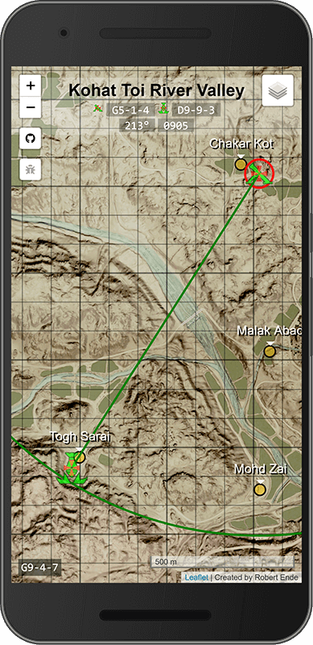

# SquadMC

SquadMC is a map-based mortar elevation and bearing calculator for [Squad](http://joinsquad.com/)

The most recent version is hosted on heroku: https://squadmc.herokuapp.com
 * created using [leaflet](http://leafletjs.com/)
 * elevation calculation taken from [squadcalc.com](https://squadcalc.com/) (github repository [here](https://github.com/lorenmh/sc-react))
 * Keypad grid originally based on [Leaflet.SimpleGraticule](https://github.com/ablakey/Leaflet.SimpleGraticule), but not much is left from the original code

Special thanks to the people over at [www.airpressuretendency.net](https://www.airpressuretendency.net/fcsquad/squadmaps/). Their interactive maps were the inspiration for this project.

_Created by Robert Ende_