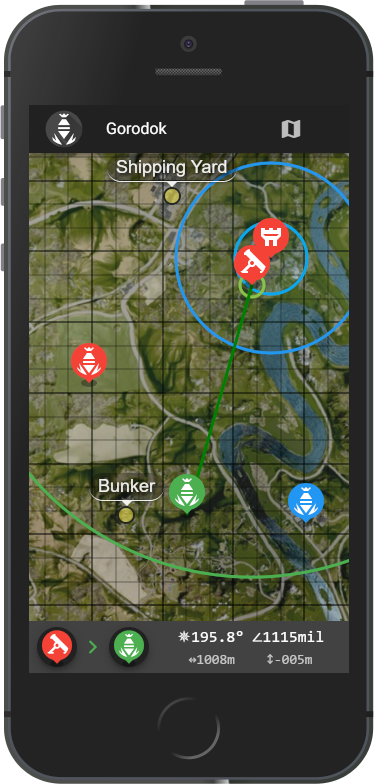

# SquadMC - The Map-based Mortar Calculator For Squad



SquadMC is a map-based mortar elevation and bearing calculator for [Squad](http://joinsquad.com/).

The most recent version is hosted here: https://squadmc.

## Features
 * highly accurate elevation and bearing calculation, using heightmaps and mortar shell trajectory function
 * optimized for mobile
 * quick placement and dragging of mortar, target, and FOB markers
 * supports multiple mortar, target, and FOB markers, and allows switching between them
 * min & max mortar range indication
 * max build range and min distance to next FOB indication
 * keypad grid (toggleable)
 * keypad coordinates calculation
 * location markers (toggleable)
 * visible heightmap (toggleable)


## installation

### Installation Prerequisites

 * You need a recent NodeJS version installed on your machine. Get it [here.](https://nodejs.org/en/)
 * Install yarn for a faster installation:
   ```
   npm install -g yarn
   ```

### Cloning repository & installing dependencies

```
git clone https://github.com/Endebert/squadmc.git
cd squadmc
yarn install
``` 

### Running development mode

For development mode with hot-reload, execute:
```
yarn run serve
```

### Building production version

For an optimized build ready for deployment, execute: 
```
yarn run build
```

## Contributors
 * [Trikolon](https://github.com/Trikolon)

## Attributions
 * Visual framework: [Vue](https://vuejs.org/) & [Vuetify](https://vuetifyjs.com)
 * Map framework: [leaflet](http://leafletjs.com/)
 * Keypad grid originally based on [Leaflet.SimpleGraticule](https://github.com/ablakey/Leaflet.SimpleGraticule), but not much is left from the original code
 * Special thanks to the people over at [www.airpressuretendency.net](https://www.airpressuretendency.net/fcsquad/squadmaps/). Their interactive maps were the inspiration for this project.
